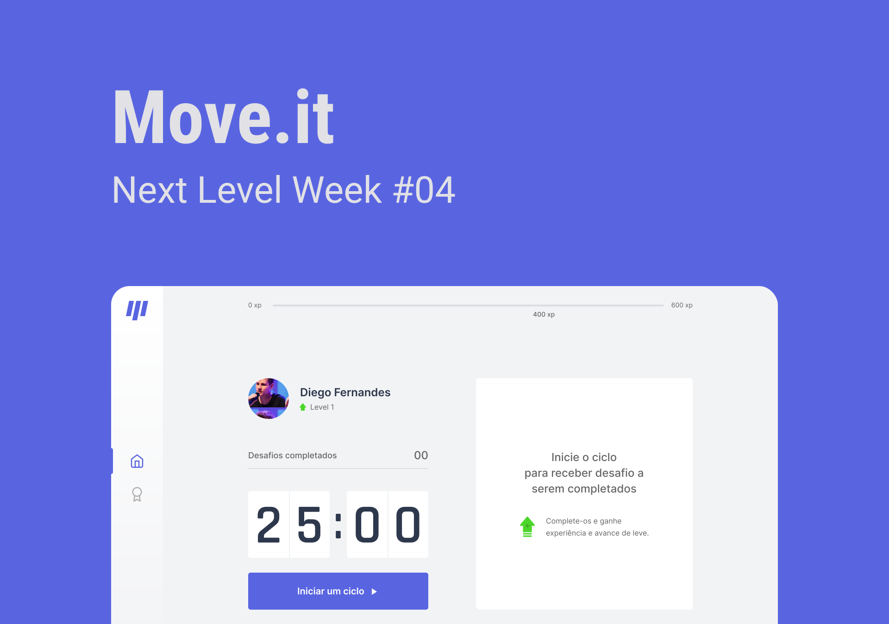

<p align="center">
  
</p>

<p align="center">
    
</p>

## 🧪 Technologies

This project was developed using the following technologies:

- [React](https://reactjs.org)
- [Next.js](https://nextjs.org/)
- [TypeScript](https://www.typescriptlang.org/)

## 🔥 Preview

The easiest way to deploy your Next.js app is to use the [Vercel Platform](https://vercel.com/new?utm_medium=default-template&filter=next.js&utm_source=create-next-app&utm_campaign=create-next-app-readme) from the creators of Next.js.

[](https://moveit-virid-seven.vercel.app/)

## 🚀 Getting started

Clone the project and access the folder.

```bash
$ git clone https://github.com/jneris-dev/moveit.git
$ cd moveit
```

Follow the steps below:
```bash
# Install the dependencies
$ yarn

# Start the project
$ yarn dev
```
The app will be available for access on your browser at http://localhost:3000

## 💻 Project

[Move.it](https://moveit-virid-seven.vercel.app/) came to remind you to exercise always! 💜

This is a project developed during the [Next Level Week](https://nextlevelweek.com/), presented by [@Rocketseat](https://github.com/Rocketseat) during February 22-28, 2021.

## 🔖 Layout

You can view the project layout through the links below:

- [Layout Web](https://www.figma.com/file/ge20pu3ofMOKoliUyKx1Nl/Move.it-1.0/duplicate) 

Remembering that you need to have a [Figma](http://figma.com/) account to access it.

## 📝 License

This project is licensed under the MIT License. See the [LICENSE](LICENSE.md) file for details.


---

<p align="center">Made with 🖤 by João Neris</p>
